# Furin Shop

- An e-commerce platform for online clothing retail and store management.

## Tech Stack

- Laravel, PHP, Ajax, Bootstrap, MySQL.

## Features

### 1. Customer Features

- User authentication
- Update personal information and change password
- Browse products
- Search products by name or category
- View product details
- Manage favorite products
- View related product recommendations
- View featured, best-selling, and trending products
- Reset password via email
- Manage shopping cart
- Place orders and receive email confirmations
- Pay online via VNPAY or PayPal
- Filter products by category, price, size, color, or brand
- Confirm, cancel, or return orders
- View order history

### 2. Admin Features

- Manage products (create, view, update, delete)
- Manage product details, including sizes, colors, images, and stock
- Manage brands
- Manage product categories
- Manage customers, including viewing information and locking accounts
- Manage orders, including confirmation, shipping, and cancellation
- Manage employees
- Update personal information and change password
- View sales statistics by year and month
- View order statistics and daily order counts
- Manage user roles and permissions

## Screenshots

Here are some screenshots showcasing the application.


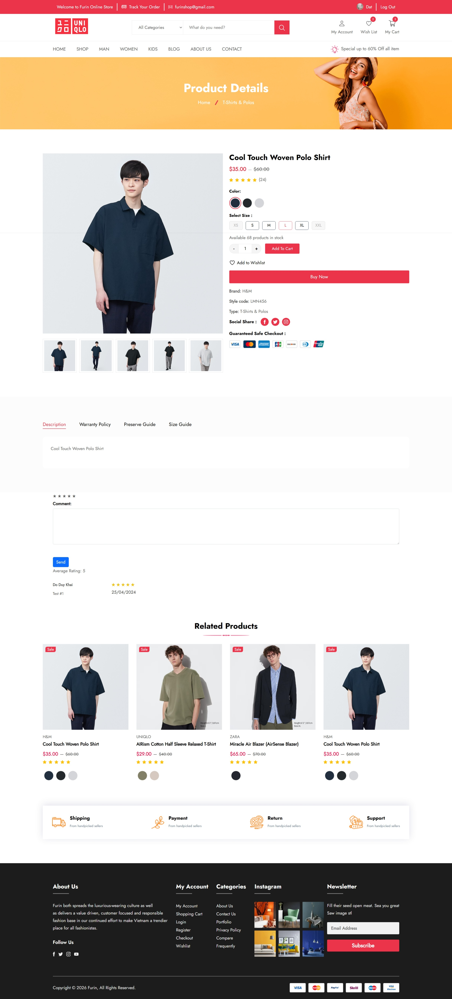
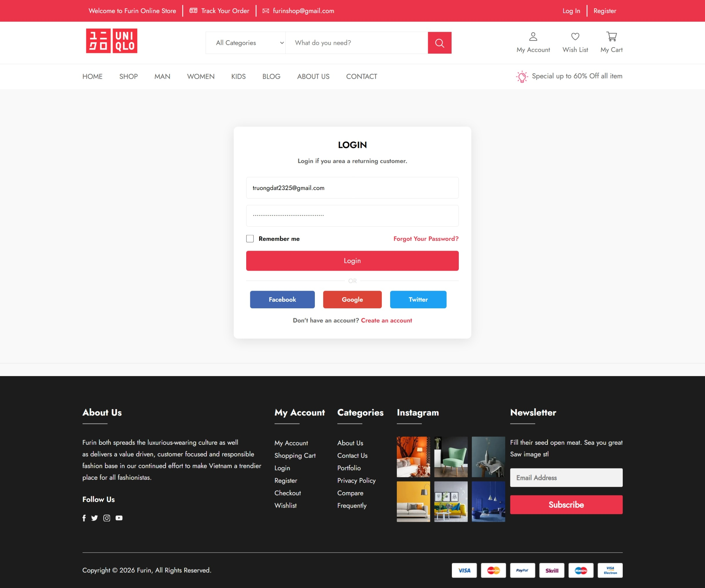
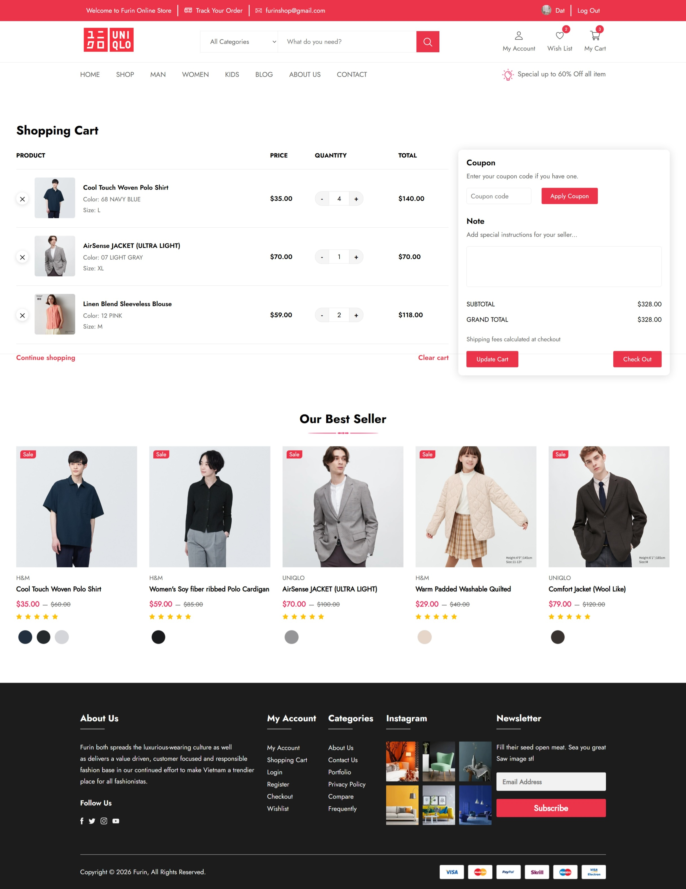
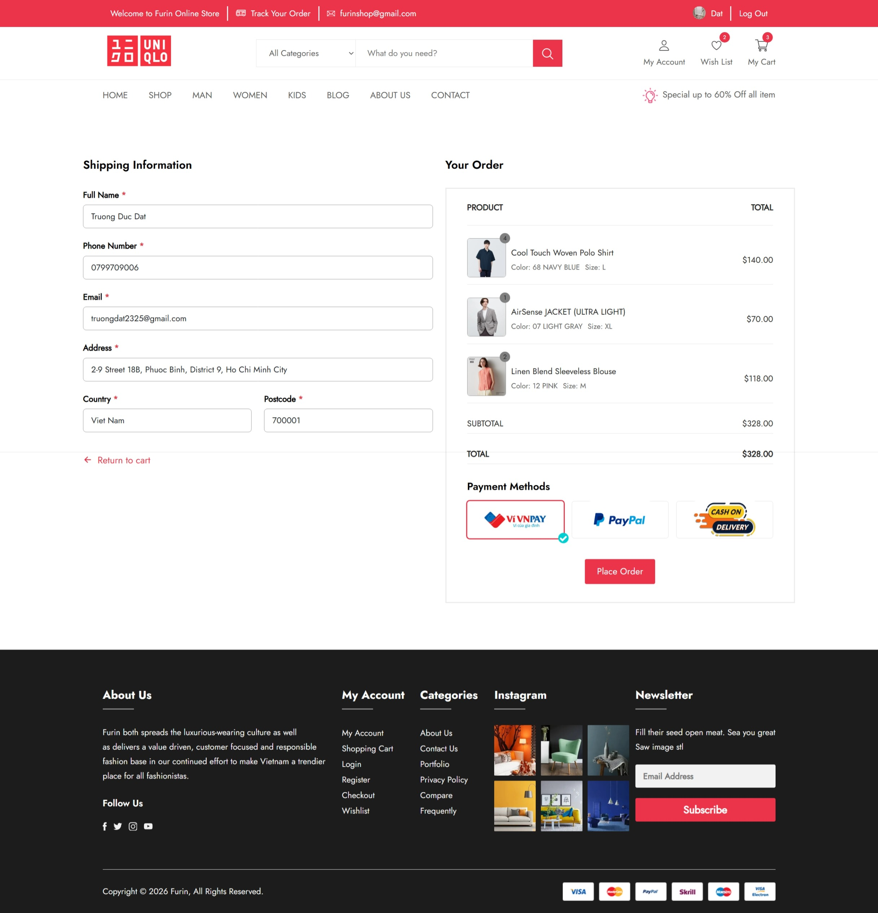

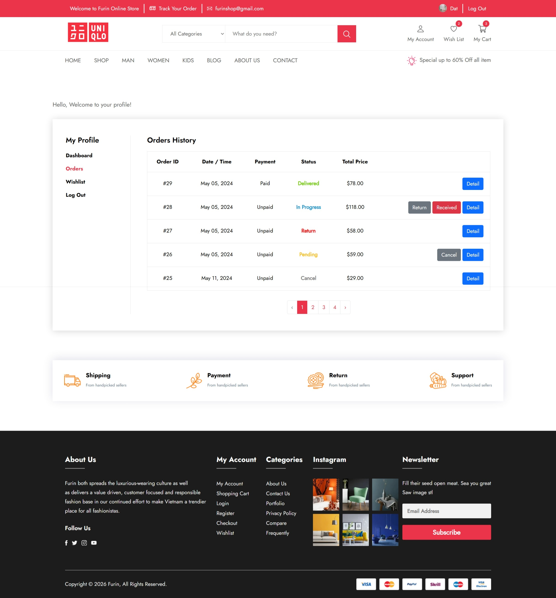
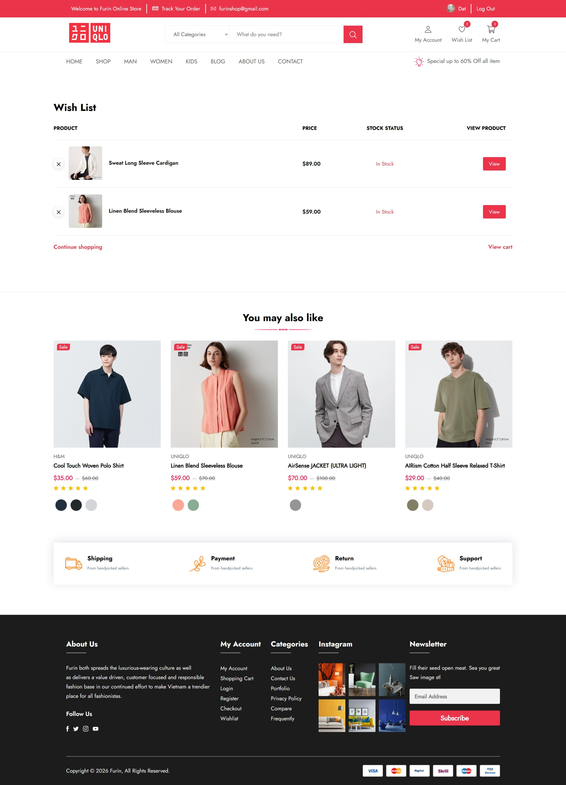

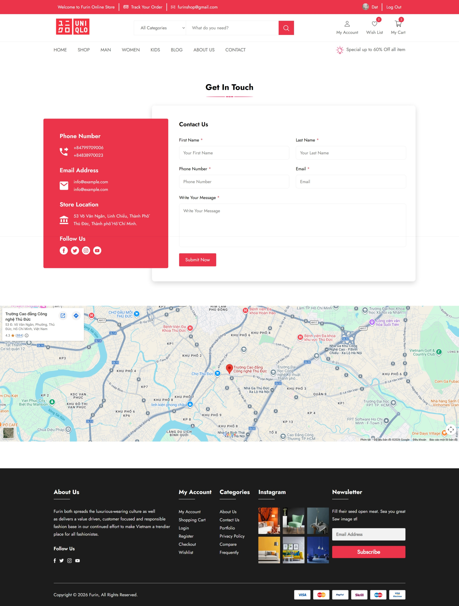
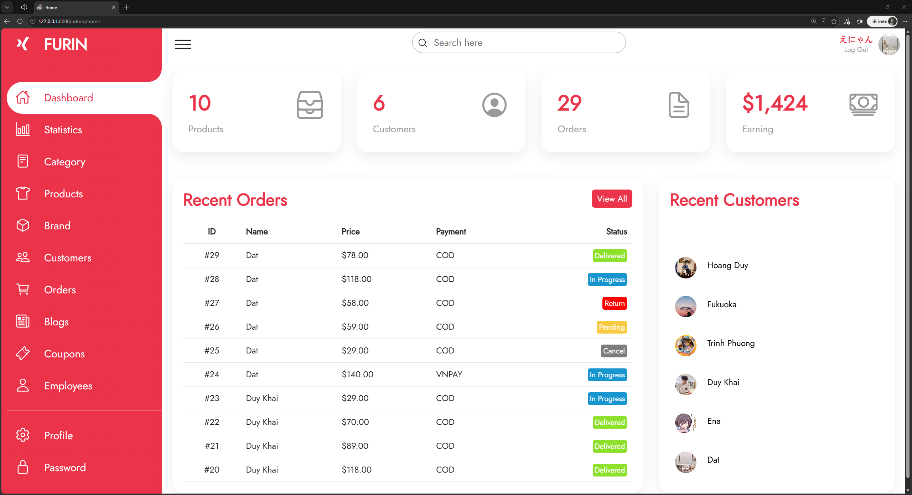
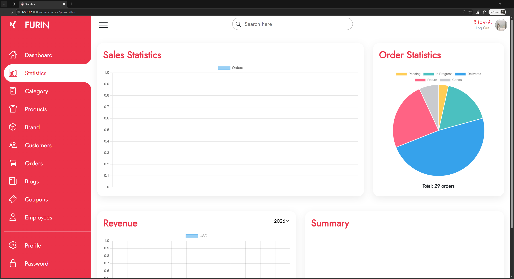
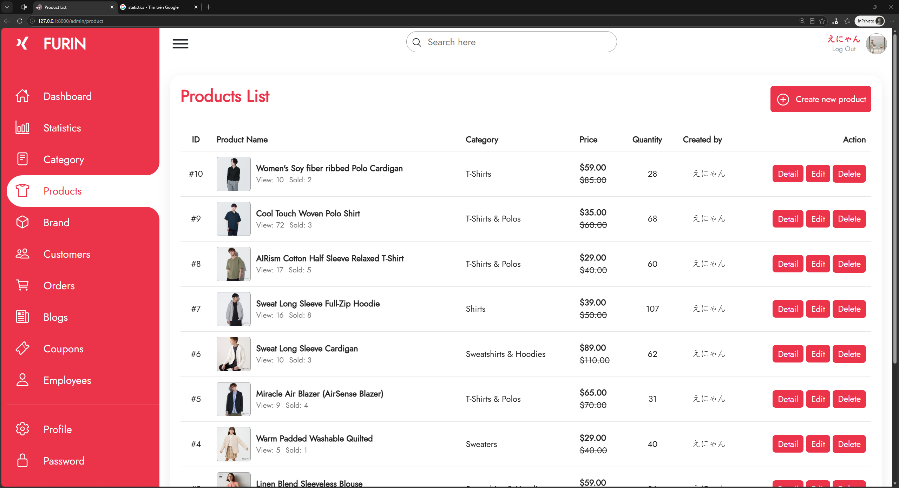
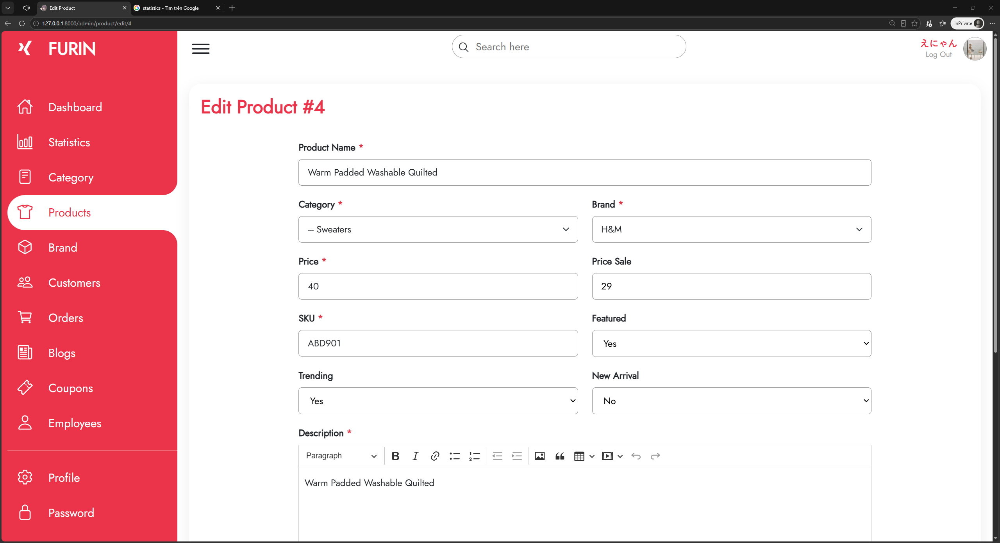
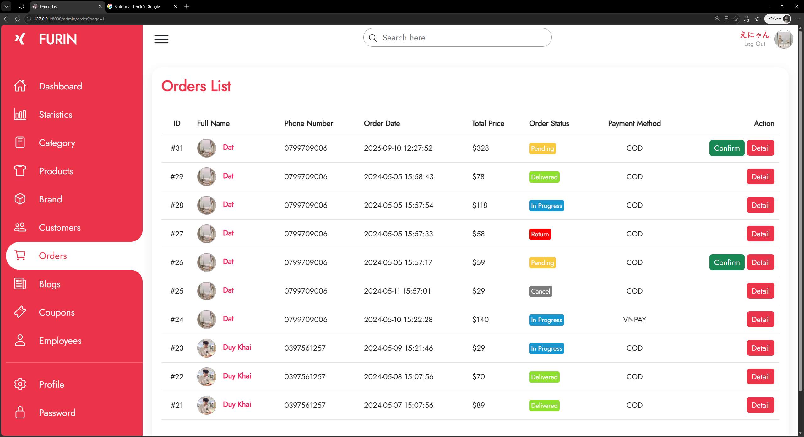
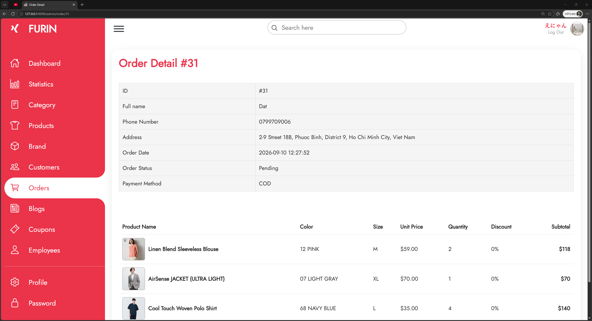
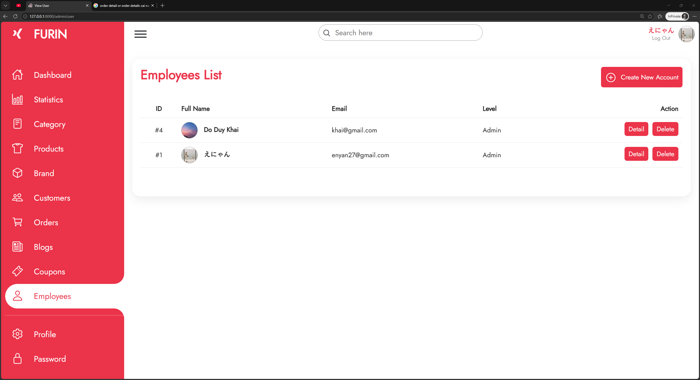
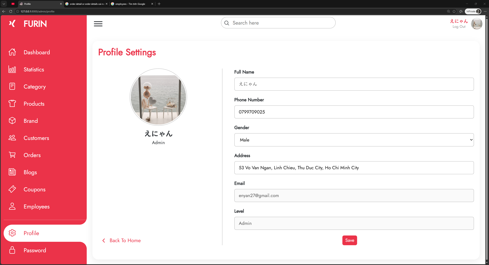

## Prerequisites

- [PHP](https://www.php.net)
- [Composer](https://getcomposer.org)
- [XAMPP](https://www.apachefriends.org)

## Installation

```bash
# Clone the repository
git clone https://github.com/enyan27/T7BE2-furin-shop.git

# Navigate to the project directory
cd T7BE2-furin-shop

# Install PHP dependencies
composer install

# Create the environment file
cp .env.example .env

# Start the development server
php artisan serve
```
