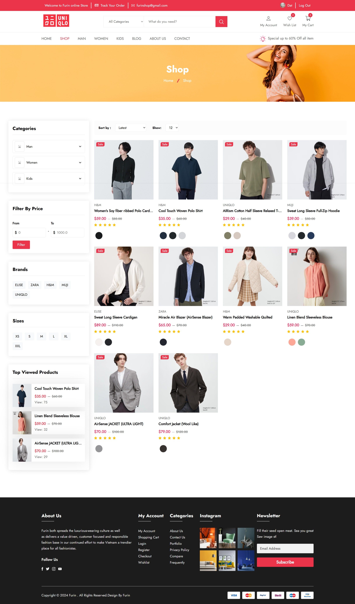
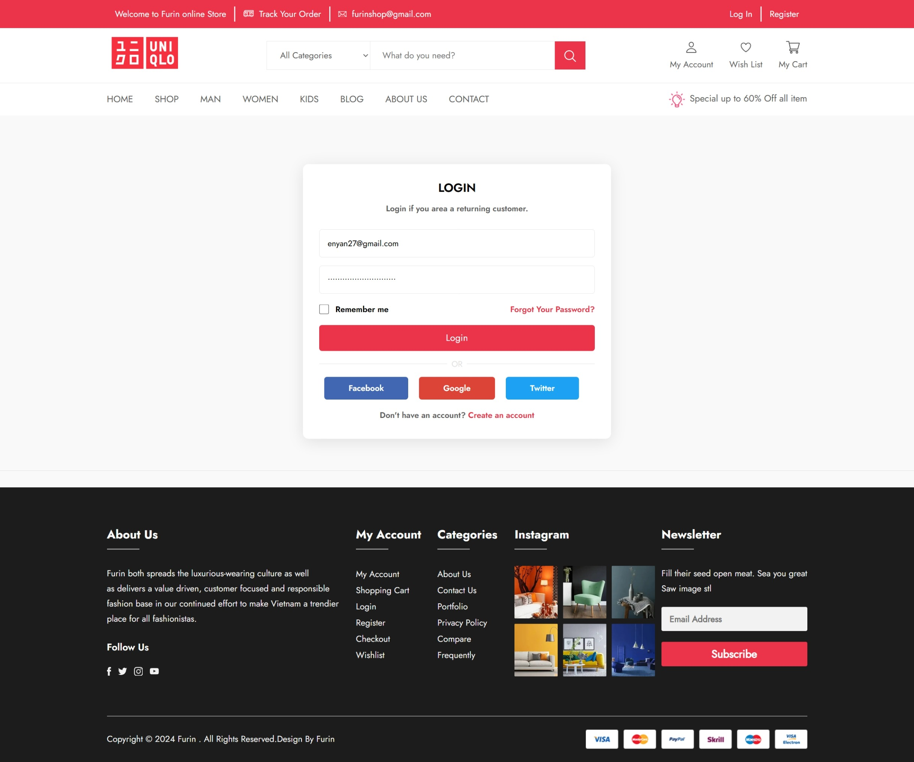
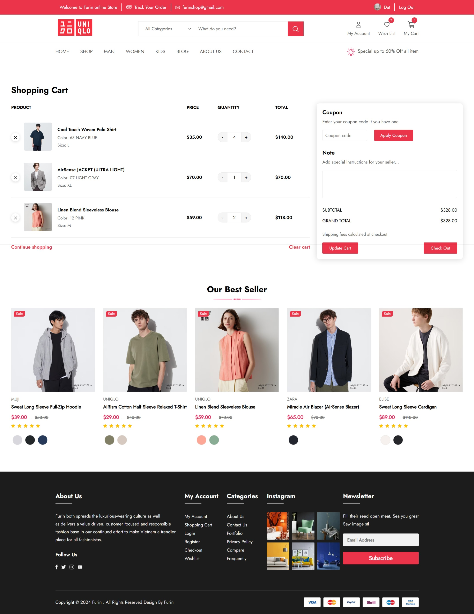
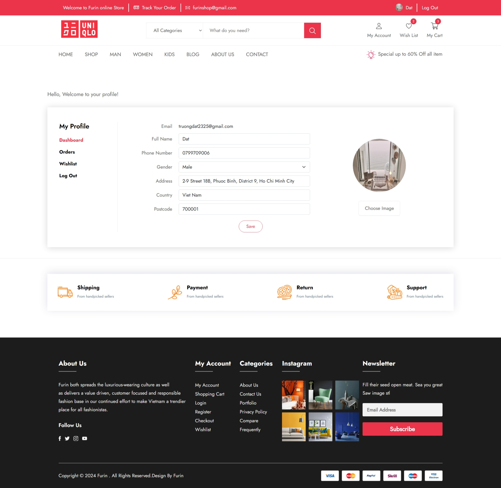
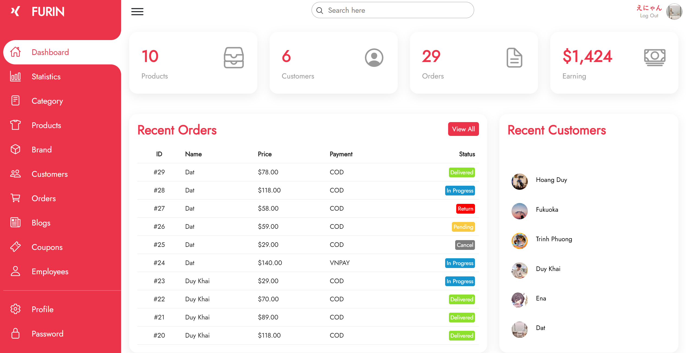
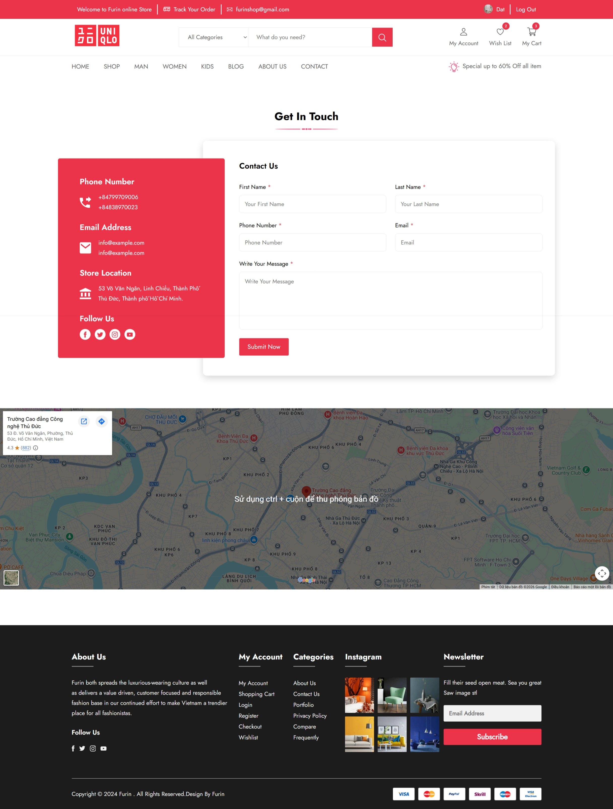

# Furin Shop

TODO

## Tech Stack

- Laravel/PHP, HTML, CSS, JavaScript, Ajax, Bootstrap, MySQL,...

## Screenshots

Here are some screenshots showcasing the application.

<table>
  <tr>
    <td></td>
    <td></td>
  </tr>
  <tr>
    <td></td>
    <td></td>
  </tr>
  <tr>
    <td></td>
    <td></td>
  </tr>
  <tr>
    <td></td>
    <td></td>
  </tr>
  <tr>
    <td></td>
    <td></td>
  </tr>
  <tr>
    <td></td>
    <td></td>
  </tr>
</table>

## Features

TODO

## Prerequisites

- [Node.js](https://nodejs.org/)

## Installation

TODO
